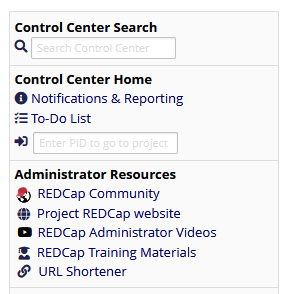

# Control Center Search

## About

Control Center Search is a REDCap External Module that adds search functionality to the Control Center.

## Installation

Please install from the REDCap Repo

## Usage

Once enabled, it adds a search bar to the top of the left-side menu in the control center.

Type the phrase you'd like to search for, and the module filters the links in the left-side menu to include only the pages that contain that text.

When you hover over any of the control center links after searching, a preview of the matched text in context will appear.

Clicking on any of the matches will take you to that page and scroll you to the appropriate section of the page.

*Note: Any spaces in the search term are replaced with wildcards to make the search a little more flexible (E.g., "The greatest" will find "**The** cake is my **greatest** joy")*

## Configuration

### Excluding links from search

You can exclude specific Control Center links from being searched. In the module's system configuration (**Control Center → External Modules → Manage → Configure**), add one or more entries to the repeatable setting **"Link to exclude from search"**:

- **Contains match**: Enter plain text to exclude any link whose name contains that text (case-insensitive). For example, entering `user` would exclude "Browse Users", "Add Users (Table-based Only)", "User Settings", etc.
- **Exact match**: Surround the text in double quotes to exclude only links whose name matches exactly. For example, entering `"User Settings"` would exclude only the "User Settings" link.

Excluded links are not fetched or searched, so excluding links can also speed up the initial indexing of the Control Center.

## Help

You may submit an issue on Github or email [Andrew Poppe](mailto:andrew.poppe@yale.edu)

