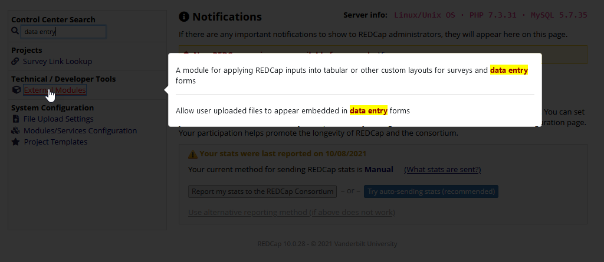

# Control Center Search

## About

Control Center Search is a REDCap External Module that adds search functionality to the Control Center.

## Installation

Please install from the REDCap Repo

## Usage

Once enabled, it adds a search bar to the top of the left-side menu in the control center.

Type the phrase you'd like to search for, and the module filters the links in the left-side menu to include only the pages that contain that text.

*Note: Any spaces in the search term are replaced with wildcards to make the search a little more flexible (E.g., "The greatest" will find "**The** cake is my **greatest** joy")*

If you hover over one of the links after searching, it will show you a preview of the matched text in context.

## Help

You may submit an issue on Github or email [Andrew Poppe](mailto:andrew.poppe@yale.edu)

